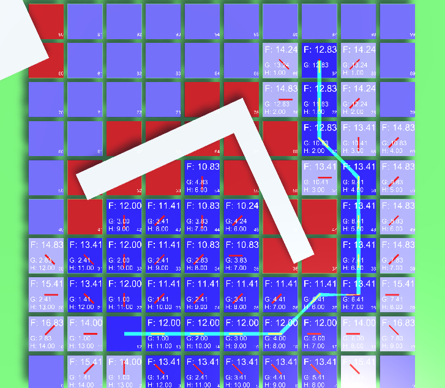
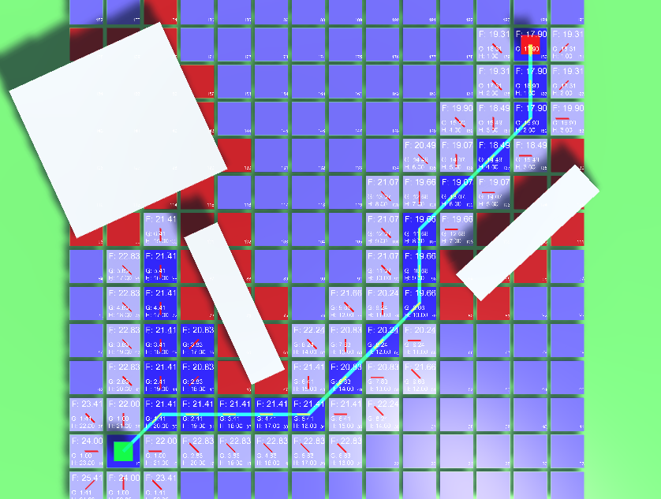
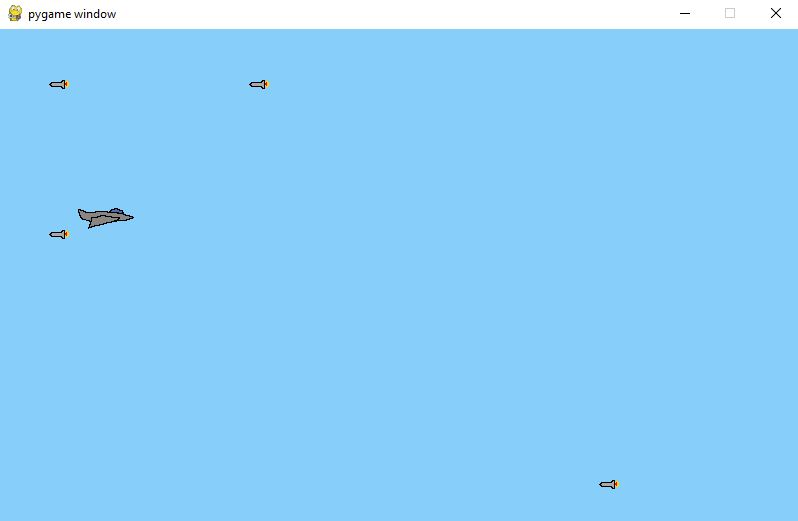

# A_Star_Algorithm_Ai-Game (Jet-Missile)

In this game, you control a jet trying to avoid enemy missiles using arrow keys. The enemies intelligently pursue your jet using A* pathfinding, making it challenging to evade them. Dodge the missiles for as long as possible to survive!

**Implementation:**
This project implements the A* algorithm in Python to create an engaging game where enemies track the player's position intelligently.

## How A* Works

A* (A-star) is a pathfinding algorithm that efficiently finds the shortest path between two points. Here's a brief overview:

1. **Initialization:**
   - A* starts with a start node and a target node.
   - It creates an open set containing the start node.

2. **Main Loop:**
   - A* evaluates nodes based on the cost to reach them and an estimate of the cost to reach the target (heuristic).
   - It selects the node with the lowest total cost from the open set.
   - The selected node is removed from the open set and added to the closed set.
   - A* expands nodes adjacent to the selected node and adds them to the open set if they haven't been visited before.
   - The process continues until the target node is reached or there are no more nodes to explore.

3. **Path Reconstruction:**
   - Once the target node is reached, A* reconstructs the path from the start node to the target node.

### How A* Works Illustrations:

| Step 1: Initialization | Step 2: Main Loop |
| ---------------------- | ----------------- |
|  |  |

## Game Graphics

- `missile.png`: Image representing enemy missiles.
- `jet.png`: Image representing the player's jet.
- `cloud.png`: Image representing background/clouds.

### Gameplay:

- The player controls the jet using arrow keys.
- Enemy missiles spawn from the right side and pursue the player using A* pathfinding.
- The player must dodge the missiles for as long as possible to survive.

### Developer:

- **Developer:** Sahir Ahmed
- 

## Screenshots:

 

### How to Run:

1. Make sure you have Python and Pygame installed.
2. Clone this repository.
3. Run `python main.py` to start the game.

Enjoy the game and happy dodging! 🚀🎮

